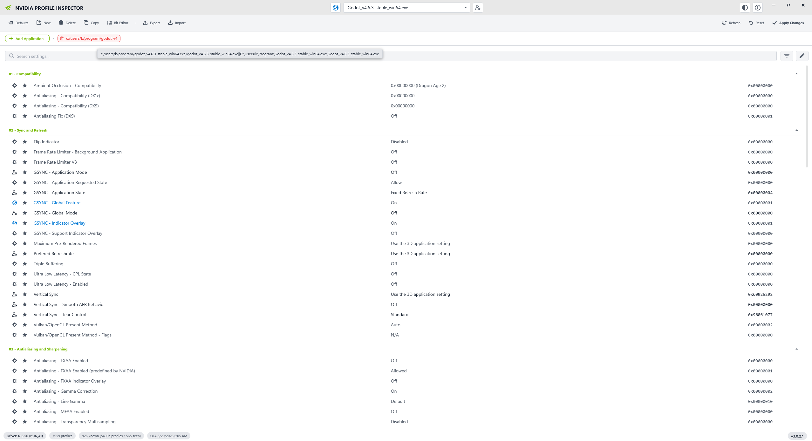
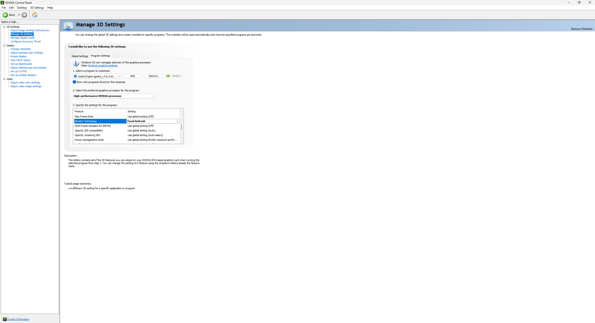
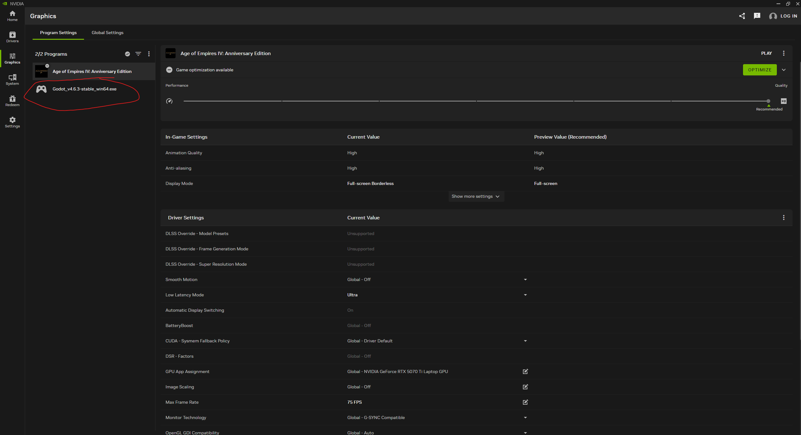
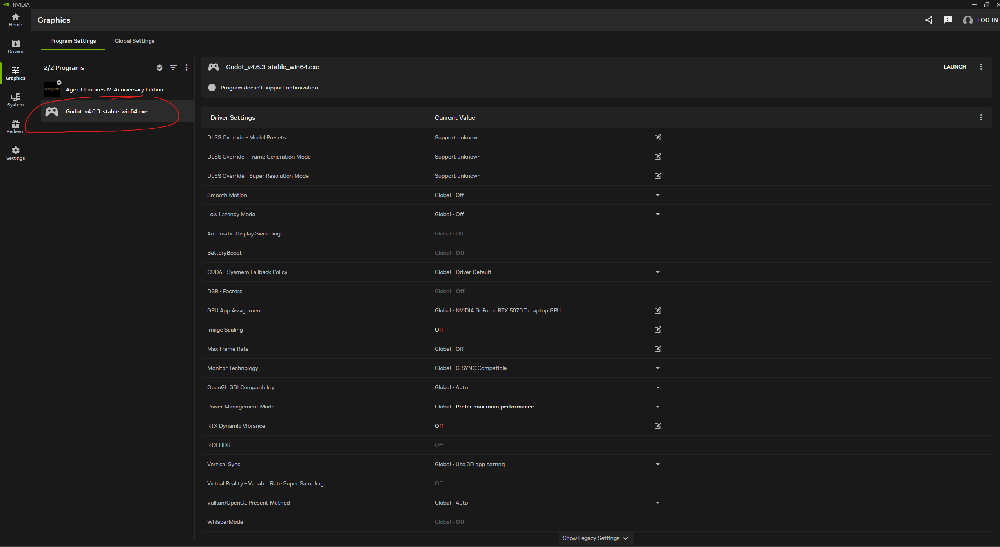

# Evidence snapshot

Initial snapshot completed: 2026-08-28 14:59 PDT

Follow-up evidence incorporated through: 2026-08-28 16:19 PDT

## Environment

```text
GPU: NVIDIA GeForce RTX 5070 Ti Laptop GPU
Driver: 616.56
NVIDIA App: 11.0.8.299
Windows build: 26200
Godot: 4.6.3.stable.official
Godot executable: C:\Users\k\Program\Godot_v4.6.3-stable_win64.exe\Godot_v4.6.3-stable_win64.exe
Project: C:\Users\k\Repository\Godot\VsyncStutterTest\Godot
Project rendering driver: d3d12
Project rendering method: Forward Plus
Project window mode: exclusive fullscreen (`window/size/mode=4`) for the game
Project V-Sync: disabled
```

## Reproduction timeline from local state

```text
14:49:19  Active NVIDIA DRS database and selector file rewritten.
14:49:24  NVIDIA App records Godot as recently launched.
14:49:35  NVIDIA backend resolves running Godot to exact-path profile
           Godot_v4.6.3-stable_win64.exe.
14:50:09  NVIDIA backend processes AoE4 and reloads DRS.
14:51:36  NVIDIA backend records the AoE4 session ending.
14:59:28  Read-only NVIDIA API query reports globalGsyncState=1,
           indicator=1, vrrMode=1, and both displays gsync enabled.
15:09:34  User applies global G-SYNC disabled; NVIDIA API call succeeds.
15:09:43  User applies global G-SYNC enabled; NVIDIA API call succeeds.
15:09:54  NVIDIA App records the subsequent AoE4 launch.
15:11:37  NVIDIA backend detects the AoE4 session ending.
           User observed the top-right G-SYNC indicator during this run.
15:13:50  NVIDIA records NVIDIA Profile Inspector running.
           User deletes the exact-path Godot profile.
15:15:04  Active DRS database written while applying the remaining
           Godot Engine profile as Fixed Refresh in NVIDIA Control Panel.
15:15:32  First Godot process starts; active DRS database and selector rewritten.
15:15:35  Spawned Godot editor process starts.
           User observes a roughly three-second blank on both displays.
15:16:07  AoE4 process starts.
           User observes no G-SYNC indicator.
15:17:38  NVIDIA backend detects the AoE4 session ending.
15:40:39  User selects the surviving Godot row in NVIDIA App.
           NVIDIA App creates an empty DRS profile named after the executable,
           fails to associate the already-owned executable, and saves DRS.
15:40:43  NVIDIA backend resolves the executable to Godot Engine.
15:46:09  NVIDIA App successfully deletes manual Godot application 963528738
           and removes the empty named DRS orphan.
15:46:23  DRS write aligns with the user's deletion of the remaining
           Godot Engine profile in NVIDIA Profile Inspector.
15:50:25  Exhaustive read-only DRS scan finds no profile or application field
           containing "godot" among all 7957 profiles, with no scan failures.
15:54:28  Direct D3D12 editor launch begins writing ordinary project metadata.
15:54:45  Last editor/project metadata write from the direct session.
15:55:42  NVIDIA backend process sampler observes the Godot executable and
           resolves an empty DRS profile name; DRS is loaded read-only.
15:56:42  NVIDIA's next process sample no longer lists Godot.
15:57:59  Direct process/DRS query confirms no Godot process and an unchanged,
           clean 7957-profile DRS state.
16:02:57  NVIDIA App catalog records the subsequent AoE4 launch.
           User observes the top-right G-SYNC indicator and closes AoE4.
16:03:06  NVIDIA backend processes AoE4 and reads DRS; DRS files remain
           byte-for-byte identical to the clean baseline.
```

## DRS files after reproduction

```text
C:\ProgramData\NVIDIA Corporation\Drs\nvdrsdb0.bin
  last write: 2026-08-28 14:25:55 PDT
  SHA-256: 932FB989C4E941253E15B1B3E5F95D5354B925CFD990147C59F51604499A98CD

C:\ProgramData\NVIDIA Corporation\Drs\nvdrsdb1.bin
  last write: 2026-08-28 14:49:19 PDT
  SHA-256: DCA3E2C3A351354AA91A240962479F818B71BD1E593E0104D237B03DBBA93625

C:\ProgramData\NVIDIA Corporation\Drs\nvdrssel.bin
  last write: 2026-08-28 14:49:19 PDT
```

## Live NVIDIA display API after reproduction

From NVIDIA App's `DisplaysService` and `UXDriver.NvCpl` logs generated by a read-only launch:

```text
2026-08-28 14:59:28.918 GetGsyncGlobalState: 1
2026-08-28 14:59:29.028 GetGsyncIndicator: 1
globalGsyncState: 1
vrrMode: 1

DDS:
  bIsSupported: true
  bIsAutomatic: false
  MuxState: 1
  kmdResponse: 1

Display nvDisplayId 5:
  originalName: Asustek Computer Inc PA278QGV
  gsyncType: 3
  enabled: true

Display nvDisplayId 1:
  originalName: Asustek Computer Inc PA278QGV
  gsyncType: 3
  enabled: true
```

## Godot profile state after reproduction

The full-path lookup selects `Godot_v4.6.3-stable_win64.exe`; the basename lookup separately selects `Godot Engine`.

```text
Godot_v4.6.3-stable_win64.exe
  association: exact full path
  predefined: false
  explicit setting count: 7
  VRR requested state: disabled
  G-SYNC application override: fixed refresh
  G-SYNC mode: disabled

Godot Engine
  association: executable basename
  predefined: false
  explicit setting count: 2
  G-SYNC mode: fullscreen only
  OpenGL threaded optimization: disabled
```

Comparison against `../2026-08-28 gsync investigation/godot-nvapp-postlaunch-query-output.txt` returned no differing line.

## AoE4 profile state after reproduction

Both full-path and basename lookups select predefined profile `Age of Empires IV` for `RelicCardinal.exe`.

```text
G-SYNC application override: allow (inherited from global profile)
VRR requested state: fullscreen only
G-SYNC mode: fullscreen only
Frame rate limiter: 75 FPS
Preferred refresh rate: highest available
```

There is no fixed-refresh or G-SYNC-disabled AoE4 setting.

## Verified recovery test

User-supplied sequence, with no other issue-related action since the failed reproduction:

```text
Open NVIDIA App.
Disable G-SYNC and apply.
Enable G-SYNC and apply.
Close NVIDIA App.
Open AoE4 and observe the top-right G-SYNC indicator.
Close AoE4.
```

Corroborating NVIDIA log records:

```text
2026-08-28 15:09:34.521
  SetGsyncGlobalState: GsyncState=0, globalVRRMode=0

2026-08-28 15:09:37.814
  SetGlobalGsyncState successful
  API duration: 3528.9 ms

2026-08-28 15:09:43.082
  SetGsyncGlobalState: GsyncState=1, globalVRRMode=1

2026-08-28 15:09:43.086
  SetGlobalGsyncState successful
  API duration: 233.4 ms

ApplicationStorage LastLaunchTimeISO for AoE4:
  2026-08-28 22:09:54Z (15:09:54 PDT)

2026-08-28 15:11:37.470
  NVIDIA backend: Age of Empires IV finished execution
```

DRS writes:

```text
nvdrsdb0.bin  2026-08-28 15:09:34 PDT
nvdrsdb1.bin  2026-08-28 15:09:43 PDT
nvdrssel.bin  2026-08-28 15:09:43 PDT
```

Post-recovery AoE4 DRS query:

```text
Selected profile: Age of Empires IV
G-SYNC application override: allow (global profile)
VRR requested state: fullscreen only (AoE4 profile)
G-SYNC mode: fullscreen only (AoE4 profile)
```

The successful indicator observation following only the global off/on cycle confirms that the earlier failure was recoverable live display/VRR state. No application-profile repair was required.

## One-profile Fixed Refresh isolation test

The user performed no other issue-related action between the verified recovery test and this sequence:

```text
Use NVIDIA Profile Inspector to delete the exact-path
Godot_v4.6.3-stable_win64.exe profile.

Use NVIDIA Control Panel to set the remaining Godot Engine profile's
Monitor Technology to Fixed Refresh.

Open Godot 4.6.3 and open the VsyncStutterTest project.
Observe both monitors blank for roughly three seconds.
Observe no G-SYNC indicator or behavior in the editor.
Close Godot.

Open AoE4.
Observe no G-SYNC indicator.
```

User-supplied screenshots preserved as evidence:





```text
npi-exact-path-profile-before-deletion.png
  original timestamp: 2026-08-28 15:14:26.891 PDT
  SHA-256: 226CEC1437F48B157CFB84B8292BD3F3F2C100CD3A5C0D1383C64E4DF05B2782

nvcp-godot-engine-fixed-refresh.png
  original timestamp: 2026-08-28 15:15:19.690 PDT
  SHA-256: DDE4FB212E9763731E57E4FFEBA2900A469B4B0A320FC94A63664516EE4ACE3D
```

Post-failure DRS identity and selection:

```text
Total profile count: 7958 (previously 7959)
FindProfileByName("Godot_v4.6.3-stable_win64.exe"): not found
FindApplicationByName(full path): Godot Engine
FindApplicationByName(basename): Godot Engine
Application association: godot_v4.6.3-stable_win64.exe
```

The only remaining Godot profile has nine explicit settings. Relevant values:

```text
VRR requested state (0x1094F1F7): disabled (0)
G-SYNC application override (0x10A879CF): fixed refresh (4)
G-SYNC mode (0x1194F158): fullscreen only (1)
OpenGL threaded optimization (0x20C1221E): disabled (2)
```

Both full-path and basename lookups now fall through to the same basename profile. This proves deletion of the exact-path profile succeeded and eliminates dual-profile selection as a necessary condition.

Active DRS file state after the test:

```text
nvdrsdb0.bin
  last write: 2026-08-28 15:15:04.425 PDT
  SHA-256: 3EFEF7CCDE83F00AC176B9D6ACCDE5D4445C49CA6CF9EE91CB3EAAA932C024FF

nvdrsdb1.bin
  last write: 2026-08-28 15:15:32.915 PDT
  SHA-256: C54720A7DBE38AD5CFD4FFEB7C9B7D9BBA54C185604E52270F0AFD7C1F9DD56A

nvdrssel.bin
  last write: 2026-08-28 15:15:32.915 PDT
  SHA-256: 4BF5122F344554C53BDE2EBB8CD2B7E3D1600AD631C385A5D7CCE23C7785459A
```

NVIDIA process evidence:

```text
15:13:50.349  nvidiaProfileInspector process observed
15:15:32.762  first Godot process observed
15:15:35.244  second Godot/editor process observed
15:16:07.714  first RelicCardinal/AoE4 process observed
15:17:38.725  NVIDIA backend records Age of Empires IV ending
```

The AoE4 profile remains unchanged and G-SYNC-capable after the failed run:

```text
Selected profile: Age of Empires IV
G-SYNC application override: allow (global profile)
VRR requested state: fullscreen only (AoE4 profile)
G-SYNC mode: fullscreen only (AoE4 profile)
```

No matching System or Application event was recorded from 15:13 through 15:19 for `Display`, `nvlddmkm`, display-related `Kernel-PnP`, `Kernel-Power`, WHEA, Application Error, or Windows Error Reporting. There was again no TDR/crash evidence.

This test rules out the deleted exact-path profile, the two-profile split, and NVIDIA App profile creation as required causes. The remaining common factors are Fixed Refresh on the profile selected for Godot and the native-OpenGL project manager's DRS save/reload.

## NVIDIA App row after exact-path DRS profile deletion

The user observed that NVIDIA App continued to list `Godot_v4.6.3-stable_win64.exe` after the exact-path DRS profile was deleted in NVIDIA Profile Inspector.



```text
nvidia-app-godot-inventory-after-drs-profile-deletion.png
  original timestamp: 2026-08-28 15:37:28.237 PDT
  SHA-256: 985F505FD26D65AB85839B84900C05D418827B8408EF0784B2AD32606FF5B888
```

Current NVIDIA App application-catalog record:

```text
Source:
  C:\Users\k\AppData\Local\NVIDIA Corporation\NVIDIA App\NvBackend\ApplicationStorage.json
File last write:
  2026-08-28 15:16:08 PDT

LocalId: 963528738
DisplayName: Godot_v4.6.3-stable_win64.exe
ShortName: Godot_v4.6.3-stable_win64.exe
InstallDirectory: C:\Users\k\Program\Godot_v4.6.3-stable_win64.exe
DetectedFiles:
  C:\Users\k\Program\Godot_v4.6.3-stable_win64.exe\Godot_v4.6.3-stable_win64.exe
DriverProfile: <empty>
IsManuallyAdded: true
IsFingerprintDetected: false
InitialTimeISO: 2026-08-28 13:28:36 PDT
LastLaunchTimeISO: 2026-08-28 15:15:35 PDT
```

Simultaneous read-only DRS query:

```text
FindProfileByName("Godot_v4.6.3-stable_win64.exe"): -163, not found
FindProfileByName("Godot_v4.6.3-stable_win64"): -163, not found
GetNumProfiles: 7958
Full-path lookup: Godot Engine
Basename lookup: Godot Engine
Godot Engine application association: godot_v4.6.3-stable_win64.exe
Godot Engine G-SYNC application override: fixed refresh
```

NVIDIA backend runtime resolution after the deletion:

```text
15:15:38.465  DRS classification profileName=Godot Engine
15:16:38.660  DRS classification profileName=Godot Engine
```

The screenshot and catalog record explain the apparent contradiction. NVIDIA App's Program Settings sidebar starts from its application inventory. NVIDIA Profile Inspector operates on DRS profiles. Deleting a DRS profile does not delete NVIDIA App `LocalId 963528738`, and that visible catalog row currently has no stored `DriverProfile` value. The screenshot has AoE4 selected in the detail pane, so no Godot profile load or edit is shown.

## State after selecting the surviving NVIDIA App row

The user then selected the Godot row and did nothing else. The selected page is preserved here:



```text
nvidia-app-godot-row-selected-after-drs-profile-deletion.png
  original timestamp: 2026-08-28 15:41:23.556 PDT
  SHA-256: 02275763A9CCBAC8BE74EC644CAE1BF400CCBE3F7AC4739AC2A9B816F73792FE
```

The screenshot shows NVIDIA App displaying inherited/global values for the selected row, including:

```text
Monitor Technology: Global - G-SYNC Compatible
Max Frame Rate: Global - Off
Low Latency Mode: Global - Off
Power Management Mode: Global - Prefer maximum performance
Vertical Sync: Global - Use 3D app setting
```

Immediate DRS comparison:

| State | Before selecting row | After selecting row |
|---|---:|---:|
| Total profiles | 7958 | 7959 |
| Named `Godot_v4.6.3-stable_win64.exe` profile | absent (`-163`) | present |
| Applications in named profile | n/a | 0 |
| Explicit settings in named profile | n/a | 0 |
| Executable selected profile | `Godot Engine` | `Godot Engine` |

Relevant query output after selection:

```text
FindApplicationByName(full path): Godot Engine
FindApplicationByName(basename): Godot Engine
FindProfileByName("Godot_v4.6.3-stable_win64.exe"): success
GetNumProfiles: 7959

Godot Engine
  application_count: 1
  application: godot_v4.6.3-stable_win64.exe
  setting_count: 9
  VRR requested state: disabled
  G-SYNC application override: fixed refresh

Godot_v4.6.3-stable_win64.exe
  application_count: 0
  setting_count: 0
  effective VRR requested state: fullscreen only, inherited globally
  effective G-SYNC application override: allow, inherited globally
```

NVIDIA App frontend and native logs identify the failed create-first path:

```text
15:40:39.264  NvAPI_DRS_CreateApplication for
               C:\Users\k\Program\Godot_v4.6.3-stable_win64.exe\
               Godot_v4.6.3-stable_win64.exe failed with code -167
15:40:39.265  cannot create DRS app - Godot_v4.6.3-stable_win64.exe
15:40:39.285  GetProfileInfo ProfileName=Godot_v4.6.3-stable_win64.exe,
               ApplicationId=963528738
```

`-167` is `NVAPI_EXECUTABLE_ALREADY_IN_USE` (`nvapi.h`: "Application already exists in the other profile"). DRS proves that the other profile is `Godot Engine`. NVIDIA's backend resolved the same path correctly even while the frontend queried the orphan by name:

```text
15:40:43.518  Application path: <exact Godot path> Profile name: Godot Engine
15:40:49.751  Application path: <exact Godot path> Profile name: Godot Engine
```

DRS files after the selection:

```text
nvdrsdb0.bin
  last write: 2026-08-28 15:40:39 PDT
  SHA-256: 5EDDCD0A170A4BBEB6025CBC9F2E6D39C766EAD9923D8FEA8A0CEE65729B8574

nvdrsdb1.bin
  last write: 2026-08-28 15:37:05 PDT
  SHA-256: 3EB973C6BA085F7EF9DA8EF04A44828AFCCF4858F195A3E80619376178AA422A

nvdrssel.bin
  last write: 2026-08-28 15:40:39 PDT
  SHA-256: 6E340B9CFFB37A989CA544E6BB780A2C78901D3FB33738768511A30617AFA01D
```

The 15:40:39 DRS save plus the profile-count increment show that NVIDIA App committed the profile object even though application creation failed. The new object is an orphan, not an exact-path application profile.

NVIDIA App's catalog file did not change:

```text
ApplicationStorage.json
  last write: 2026-08-28 15:16:08 PDT
  SHA-256: C8BA9796A7620267DA40D47CADF7F6CA2333B6024F53609DD55DF2921CBA176D
  Godot DriverProfile: empty
```

AoE4 remains associated with `Age of Empires IV`, with VRR requested as fullscreen-only and the G-SYNC application override inherited as allow. Selecting the Godot row changed neither runtime association, but it did mutate persistent DRS and made NVIDIA App's selected-page values misleading.

## Clean baseline before the bypass launch

The user then performed exactly these issue-related actions:

```text
1. Delete the Godot profile/row from NVIDIA App.
2. Delete the Godot profile from NVIDIA Profile Inspector.
```

NVIDIA App deletion evidence:

```text
15:46:09.917  DeleteManualApplication success:1 for appId 963528738
15:46:09.922  Local id 963528738 successfully deleted from manual db
15:46:09.941  Removed DRS profile for Godot_v4.6.3-stable_win64.exe
15:46:09.942  Godot_v4.6.3-stable_win64.exe with localid 963528738
                removed successfully
```

Current NVIDIA App catalog:

```text
C:\Users\k\AppData\Local\NVIDIA Corporation\NVIDIA App\NvBackend\ApplicationStorage.json
  last write: 2026-08-28 15:46:09.917 PDT
  length: 2766 bytes
  SHA-256: 493A41D860F829C77351CBE535A664AA4B2B99D48D0F534B0B6BB43AD88441E5
  case-insensitive "godot" occurrences: 0
```

Direct read-only DRS query after both deletions:

```text
Target full path:
  C:\Users\k\Program\Godot_v4.6.3-stable_win64.exe\Godot_v4.6.3-stable_win64.exe
Target basename:
  Godot_v4.6.3-stable_win64.exe

FindApplicationByName(full path): -166, NVAPI_EXECUTABLE_NOT_FOUND
FindApplicationByName(basename): -166, NVAPI_EXECUTABLE_NOT_FOUND
FindProfileByName("Godot_v4.6.3-stable_win64.exe"): -163, NVAPI_PROFILE_NOT_FOUND
FindProfileByName("Godot_v4.6.3-stable_win64"): -163, NVAPI_PROFILE_NOT_FOUND
GetNumProfiles: 7957
No DRS application association or target-related profile name was found.
```

The profile count was 7959 immediately before the actions and measured 7957 after both. NVIDIA App logged removal of its DRS profile and wrote DRS at 15:46:09; the second DRS write at 15:46:23 aligns with the user's subsequent NVIDIA Profile Inspector deletion. The inferred intermediate sequence is 7959 to 7958 to 7957, matching removal of the empty named orphan followed by removal of `Godot Engine`.

DRS persistence at the clean baseline:

```text
nvdrsdb0.bin
  last write: 2026-08-28 15:46:09 PDT
  SHA-256: 8E5820DF6C9D6E0F5FFF07FFF189406146DA415DD93F4913CF7D88BDF4031181

nvdrsdb1.bin
  last write: 2026-08-28 15:46:23 PDT
  SHA-256: 8A239BE114F9568F83CF8C23A7EF853A9F0653ABFE610F35C7CC8B79D44B4F95

nvdrssel.bin
  last write: 2026-08-28 15:46:23 PDT
  SHA-256: 4BF5122F344554C53BDE2EBB8CD2B7E3D1600AD631C385A5D7CCE23C7785459A
```

The direct query checks the known executable and profile identities. A second read-only audit then enumerated every DRS profile and every application record, searching case-insensitively for `godot` in profile names, `appName`, `userFriendlyName`, `launcher`, `fileInFolder`, and `commandLine`:

```text
Case-insensitive DRS substring audit
Search token: "godot"
Total profiles reported: 7957
Profiles scanned: 7957
Matching profiles: 0
Matching applications: 0
Profile enumeration/info failures: 0
Application enumeration failures: 0
Audit complete: CLEAN
```

The audit implementation is preserved in `drs-substring-audit.cpp` and used only NVAPI read/session/enumeration calls; it contains no save, create, set, or delete call. No Godot or NVIDIA Profile Inspector process was running when the baseline was captured.

This establishes the pre-launch invariant for the intended bypass test:

```text
DRS profile count: 7957
Any DRS profile/application field containing "godot": none
Specific executable full-path association: none
Specific executable basename association: none
NVIDIA App application-catalog record: none
```

The target project's current `project.godot` was checked read-only and already contains:

```ini
[rendering]

rendering_device/driver.windows="d3d12"
rendering_device/fallback_to_opengl3=false
rendering_device/fallback_to_vulkan=false
```

The intended direct editor launch is therefore D3D12-or-fail. Godot 4.6.3 cannot reach its native-OpenGL NVAPI profile writer through a rendering fallback in this configuration.

## Direct D3D12 bypass result

User-supplied sequence, with no intervening NVIDIA App, NPI, or ordinary Godot project-manager launch:

```text
1. Open Command Prompt.
2. Run the direct --editor --path ... --rendering-driver d3d12 command.
3. Project opens without any monitor blink.
4. Observe the G-SYNC indicator in the top-right.
5. Move the pointer and observe choppy movement.
6. Close the editor window.
7. Wait ten seconds; the prompt does not return.
8. Close the Command Prompt window with its Windows close button.
```

Post-launch direct target query:

```text
FindApplicationByName(full path): -166, NVAPI_EXECUTABLE_NOT_FOUND
FindApplicationByName(basename): -166, NVAPI_EXECUTABLE_NOT_FOUND
FindProfileByName("Godot_v4.6.3-stable_win64.exe"): -163, NVAPI_PROFILE_NOT_FOUND
FindProfileByName("Godot_v4.6.3-stable_win64"): -163, NVAPI_PROFILE_NOT_FOUND
GetNumProfiles: 7957
No DRS application association or target-related profile name was found.
```

Post-launch exhaustive audit:

```text
Total profiles reported: 7957
Profiles scanned: 7957
Matching profiles: 0
Matching applications: 0
Profile enumeration/info failures: 0
Application enumeration failures: 0
Audit complete: CLEAN
```

Post-launch DRS file state is byte-for-byte identical to the pre-launch baseline:

```text
nvdrsdb0.bin
  last write: 2026-08-28 15:46:09 PDT
  SHA-256: 8E5820DF6C9D6E0F5FFF07FFF189406146DA415DD93F4913CF7D88BDF4031181

nvdrsdb1.bin
  last write: 2026-08-28 15:46:23 PDT
  SHA-256: 8A239BE114F9568F83CF8C23A7EF853A9F0653ABFE610F35C7CC8B79D44B4F95

nvdrssel.bin
  last write: 2026-08-28 15:46:23 PDT
  SHA-256: 4BF5122F344554C53BDE2EBB8CD2B7E3D1600AD631C385A5D7CCE23C7785459A
```

NVIDIA App's private catalog is also byte-for-byte unchanged:

```text
ApplicationStorage.json
  last write: 2026-08-28 15:46:09 PDT
  SHA-256: 493A41D860F829C77351CBE535A664AA4B2B99D48D0F534B0B6BB43AD88441E5
  case-insensitive Godot occurrences: 0
```

NVIDIA backend process/classification evidence:

```text
15:55:42.530  process sampler sees the exact Godot executable
15:55:42.564  loading DRS settings
15:55:42.658  loaded DRS settings
15:55:42.659  DRS classification profileName=<empty>
15:56:42      next sampler iteration contains no Godot image
```

This distinguishes normal driver/profile reading from profile mutation. NVIDIA noticed the D3D12 process and read DRS, but no profile matched, no application/catalog entry was created, and no DRS file changed.

AoE4's persistent state remains unchanged after the direct session:

```text
Selected profile: Age of Empires IV
G-SYNC application override: allow, inherited globally
VRR requested state: fullscreen only
G-SYNC mode: fullscreen only
```

The editor did perform ordinary project-side writes. It rewrote `project.godot` with LF line endings and reversed the order of the two fallback keys without changing their values, then updated `.godot/editor` metadata through 15:54:45. These are not NVIDIA-profile changes and have been left intact as user/project state.

Shutdown evidence:

```text
User: command prompt had not returned ten seconds after closing the editor window.
15:54:45  last project/editor metadata write
15:55:42  NVIDIA sampler still reports Godot image
15:56:42  NVIDIA sampler no longer reports Godot
15:57:59  direct process query finds no Godot process
```

The NVIDIA sampler is periodic, so it does not prove the exact exit time. No System display/TDR event, Application Hang event, WER report, or Godot crash record exists for this interval. The process-linger observation is real from the user's prompt behavior but remains separate and not yet root-caused.

## AoE4 validation after the direct bypass

Without opening NVIDIA App, NVIDIA Profile Inspector, or Godot again, the user:

```text
1. opened AoE4;
2. observed the top-right G-SYNC indicator; and
3. closed AoE4.
```

NVIDIA App's catalog independently records `LastLaunchTimeISO` as 2026-08-28 23:02:57Z, or 16:02:57 PDT. NVIDIA's backend began processing the AoE4/Steam application records at 16:03:06 and loaded DRS for its normal runtime checks.

Post-AoE4 persistent profile state:

```text
DRS profile count: 7957
Godot full-path association: absent
Godot basename association: absent
Godot-related profile names: absent

AoE4 selected profile: Age of Empires IV
AoE4 G-SYNC application override: allow, inherited globally
AoE4 VRR requested state: fullscreen only
AoE4 G-SYNC mode: fullscreen only
```

The DRS files remain identical to both the pre-Godot and post-Godot snapshots:

```text
nvdrsdb0.bin
  last write: 2026-08-28 15:46:09 PDT
  SHA-256: 8E5820DF6C9D6E0F5FFF07FFF189406146DA415DD93F4913CF7D88BDF4031181

nvdrsdb1.bin
  last write: 2026-08-28 15:46:23 PDT
  SHA-256: 8A239BE114F9568F83CF8C23A7EF853A9F0653ABFE610F35C7CC8B79D44B4F95

nvdrssel.bin
  last write: 2026-08-28 15:46:23 PDT
  SHA-256: 4BF5122F344554C53BDE2EBB8CD2B7E3D1600AD631C385A5D7CCE23C7785459A
```

`ApplicationStorage.json` changed only to record the ordinary AoE4 launch and remains free of any `godot` string:

```text
last write: 2026-08-28 16:03:06.649 PDT
SHA-256: CF9EC9DE207A512545B8715FD0F7DA9C57DF3EE662EDB8074AFF91592F330891
case-insensitive Godot occurrences: 0
AoE4 LastLaunchTimeISO: 2026-08-28 23:02:57Z
```

The physical indicator is the missing live-state proof. It confirms that the D3D12 editor session did not wedge VRR even though G-SYNC was active and pointer movement was choppy inside Godot. The verified bypass therefore preserves both persistent configuration and subsequent live G-SYNC operation.

## User assessment at investigation pause

At 16:19 PDT, the user explicitly recorded that the core practical issue remains unresolved. None of the tested approaches provides all of the following simultaneously:

```text
Godot editor: G-SYNC disabled
AoE4/other intended applications: G-SYNC enabled
No explicit global G-SYNC toggle between applications
No long monitor blank
No sticky post-Godot VRR failure
```

Observed tradeoffs at the pause point:

```text
Per-app Fixed Refresh + ordinary Godot path:
  desired editor state
  but DRS save/reload, monitor blank, and subsequent AoE4 G-SYNC failure

Direct D3D12/no-fallback path with no Godot profile:
  no DRS mutation, no monitor blank, and AoE4 G-SYNC works afterward
  but G-SYNC remains active in Godot and pointer movement is choppy

Global G-SYNC off/on:
  verified recovery/manual control
  but cumbersome and itself causes a long monitor blank
```

This is a user-facing usability requirement, not a contradiction in the technical findings. The D3D12 bypass is successful within its narrower scope, but the desired stable per-application G-SYNC policy has not been achieved.

## External-monitor topology A/B

The user later reported a clean physical-topology discriminator on an ASUS ROG Strix G18 `G815LR-IS97`:

```text
One PA278QGV on one Thunderbolt 5/USB-C port:
  smooth; the documented G-SYNC problem is absent

Two PA278QGVs, one on each Thunderbolt 5/USB-C port:
  the documented G-SYNC problem reproduces
```

The current one-external-monitor capture retains the matching `Godot Engine` profile and its Fixed Refresh/VRR-disabled settings. Windows and NVAPI map the two PAs to distinct external DP targets 8450 and 8452 on the same RTX 5070 Ti adapter. They are connector instances 0 and 1, not MST children. The current active target is 8452 at 2560x1440/119.998 Hz; target 8450 is disconnected.

The current NVIDIA driver is 596.49 (`r596_25`), installed at 16:30:31 PDT. The original Godot failure evidence used 616.56. A later Unity Fixed Refresh transition reproduced the same sticky failure on 596.49, closing the driver-branch confounder.

Full command output, PnP timestamps, interpretation, and follow-up matrix are in `topology-ab-evidence.md`. The reusable read-only probes are `display-topology-query.cpp` and `nvapi-vrr-query.cpp`.

## Mixed-MediaSync baseline and Unity transition

At 22:30, before either editor opened, both external PAs and the internal panel were active. NVAPI reported:

```text
target 8450, MediaSync on:  VRR possible=1, displayInVrrMode=1, max interval=20583 us
target 8452, MediaSync off: VRR possible=0, displayInVrrMode=0, max interval=0
target 8449, internal:      VRR possible=1, displayInVrrMode=1, max interval=9750 us
```

AoE4 then ran normally with the G-SYNC indicator. The 22:36 post-AoE state remained unchanged.

Unity's current matching profile was read back after the subsequent test:

```text
Profile: Unity 3D
Application: unity.exe
VRR requested state: disabled
G-SYNC application override: fixed refresh
G-SYNC mode: disabled
```

The user opened Unity, observed a two-to-three-second monitor blink, observed Unity without G-SYNC, closed it, and immediately tested two controls. AoE4 lacked the indicator and was clearly choppy. `VsyncStutterTest.exe` also lacked the indicator and was clearly choppy.

At 22:43, target 8450 still reported `VRR possible=1` but had changed to `displayInVrrMode=0`. The other targets retained their prior capability/mode state.

The DRS profile databases were last written at 22:11:41 and had identical SHA-256 hashes after the test:

```text
97110C9B3516B3622B3A9452CF8DF40C0B7788A2BDE9DCA0EA2F308ACEE14D02
```

Unity therefore did not rewrite DRS during the 22:36-22:43 transition. Activation of its existing Fixed Refresh profile is sufficient to produce the blink and sticky post-exit state.

`VsyncStutterTest.exe` has no full-path or basename DRS association and no matching profile name. Its failure is a neutral demonstration of inherited live/global state, not a per-app override.

Full evidence and interpretation are in `two-external-mixed-mediasync-baseline.md` and `unity-fixed-refresh-transition.md`.

The user then performed the known global G-SYNC off/apply/on/apply recovery without opening an editor or control application. At 22:51, target 8450 returned to `displayInVrrMode=1`, while its `VRR possible=1` capability and the other targets' states remained unchanged. The applies rewrote DRS at 22:50:13. This directly correlates the UI recovery with restoration of the external target's VRR display-mode state.

The user then ran `VsyncStutterTest.exe`; it showed the G-SYNC indicator and ran smoothly. At 22:55 the post-control state still had target 8450 in VRR mode and all three paths active. This validates the unprofiled executable as the replacement positive/negative control.

At 22:58, the user left both PAs connected and powered but selected `Disconnect this display` for MediaSync-off target 8452 in Windows. Windows then reported only internal target 8449 and external target 8450 as active paths. NVAPI still reported target 8452 as `connected=1`, `physicallyConnected=1`, but `active=0`, proving the intended active-head-count arm was established.

Immediately afterward, `NvAPI_Disp_GetVRRInfo` returned generic `NVAPI_ERROR` for active target 8450 on two consecutive queries, although its Adaptive-Sync capability data remained present. The neutral executable must therefore be run before Unity to establish whether G-SYNC survived the Windows topology change.

`VsyncStutterTest.exe` then showed the indicator and ran smoothly, establishing a healthy baseline despite the query error. At 23:01 the topology remained two active paths with target 8452 physically connected/inactive, and the DRS files retained their 22:50:13 timestamps and hashes. The active-head-count Unity transition is ready.

Unity was then launched under Fixed Refresh in this one-active-external topology. There was no monitor blink; Unity behaved acceptably without G-SYNC. After Unity closed, `VsyncStutterTest.exe` still showed the indicator and ran smoothly. At 23:07, target 8452 remained physically connected/inactive, the two active paths were unchanged, and both DRS timestamps/hashes matched the pre-Unity capture.

This proves two **active** external scanout heads are required. Physical connection or NVIDIA enumeration of the second PA is not sufficient.

At 23:11, the physical-route A/B baseline was established with both PAs active: target 8450 remains on TB5/DisplayPort at 119.998 Hz, while the second PA appears as new HDMI target 8448 at 59.951 Hz. The internal panel remains active, and all three paths are owned by the RTX GPU. DRS timestamps and hashes are unchanged from 22:50:13.

Unexpectedly, NVAPI reports HDMI target 8448 as `VRR possible=1`, `displayInVrrMode=1`, with a 20583-us Adaptive-Sync interval even though the user left MediaSync off in that PA's OSD. The earlier DP-connected OSD-off target 8452 reported non-VRR. This input/route discrepancy is preserved in `tb5-dp-plus-hdmi-baseline.md`; it does not invalidate the routing test, but means the HDMI arm has two NVIDIA-reported VRR-possible external targets.

The user then directly rechecked the HDMI PA's OSD and confirmed `MediaSync=off`. The read-only probes do not read that OSD setting. Earlier wording that NVAPI “verified MediaSync off” has been corrected: NVAPI independently reports NVIDIA's driver-side VRR classification/state, which was consistent with the user-observed OSD setting on DisplayPort but now diverges on HDMI.

At 23:18, the pre-Unity functional control succeeded in the TB5/DisplayPort-plus-HDMI topology. `VsyncStutterTest.exe` ran smoothly on target 8450 and displayed the G-SYNC indicator. The post-control topology, target VRR-mode bits, DRS timestamps, and DRS hashes all match the 23:11 baseline.

The Unity transition then succeeded cleanly. Unity caused no blink and ran without G-SYNC as intended. The immediate `VsyncStutterTest.exe` control retained its indicator and smooth motion. At 23:20, target 8450 remained `displayInVrrMode=1`, all paths were unchanged, and the DRS files were byte-for-byte identical to baseline. Therefore two active external heads are not sufficient. The working arm differs by both route and secondary mode: HDMI at 59.951 Hz versus TB5/DisplayPort at 119.998 Hz. It isolates a route/mode family, not connector route alone.

A read-only pre-Godot DRS audit confirms `godot_v4.6.3-stable_win64.exe` is associated with the existing `Godot Engine` profile, which explicitly sets VRR requested state disabled and G-SYNC Fixed Refresh. The routed-display workaround is ready for an exact Godot validation.

The exact Godot workflow then succeeded on its essential behavior twice: Godot used Fixed Refresh/smooth editor behavior, and each immediate `VsyncStutterTest.exe` control retained smooth G-SYNC. The first Godot project editor opened on the internal panel and produced a two-second blank before being moved to the primary PA; the second opened on the primary PA and produced no blank. At 23:28, primary target 8450 remains `displayInVrrMode=1`, while HDMI target 8448 changed to `displayInVrrMode=0`; topology is unchanged.

DRS was rewritten at 23:24:38 and 23:25:09, closely matching the two Godot launches, and both database hashes changed. The effective `Godot Engine` profile settings remain semantically unchanged. Because the second save did not blank and neither save poisoned later G-SYNC, `NvAPI_DRS_SaveSettings()` alone is not sufficient. Launch-display placement versus a one-time cold transition remains the first-blank confound.

The controlled placement repetition rules out launch display as sufficient. The user persisted Godot on the internal panel and performed two further launches; neither blanked, Godot remained smooth without G-SYNC, and the later neutral control retained smooth G-SYNC. DRS saved again at 23:31:52 and 23:32:20 without changing effective settings. At 23:33, target 8450 remains `displayInVrrMode=1`, HDMI target 8448 remains at `0`, and all paths are unchanged.

The earlier single blank is therefore a transient cold/first transition after topology/target-state changes, not a repeatable window-placement or DRS-save effect in the current evidence. The stable TB5/DisplayPort-primary-at-120-Hz plus HDMI-secondary-at-60-Hz configuration is a validated practical workaround. Reboot/hotplug recurrence and route versus refresh/load remain untested.

After reboot, the user discovered that the internal panel is required for smooth behavior in the mixed-route two-external configuration. With the internal panel Windows-disconnected, behavior is poor; reconnecting it restores smoothness. HDMI PA MediaSync on versus off did not change that observation. The current 00:11 healthy capture has the internal panel at about 240 Hz and both external PAs at 119.998 Hz, with target 8450 on TB5/DisplayPort and target 8448 on HDMI. All three targets report `displayInVrrMode=1`.

This removes the prior refresh/load confound: HDMI at 120 Hz works while internal eDP is active. It introduces a narrower topology condition. The internal eDP path stabilizes TB5/DP plus HDMI, but did not stabilize the earlier two-TB5/DP configuration. A pre-application capture with the internal panel disconnected is now required to determine whether the topology change itself breaks G-SYNC or only makes the next Fixed Refresh transition unsafe.

At 00:14, the clean internal-off arm was captured before any 3D application. Windows has only 120-Hz targets 8450 TB5/DisplayPort and 8448 HDMI active. Internal target 8449 remains physically connected but inactive with zero current lanes. DRS is byte-for-byte unchanged. HDMI target 8448 still reports `displayInVrrMode=1`; the primary DP target's VRR-info call returns generic `NVAPI_ERROR` while its Adaptive-Sync and link queries succeed. Because that API error previously coexisted with working G-SYNC, a pre-editor `VsyncStutterTest.exe` control is required.

That pre-editor control displayed the G-SYNC indicator and ran smoothly. At 00:16, topology, HDMI VRR state, DRS timestamps, and DRS hashes remain unchanged; the primary public VRR query still returns generic error despite functional G-SYNC. Thus disconnecting internal eDP alone is not sufficient. A later application/profile transition or other event is required. Unity Fixed Refresh is the next no-DRS-write isolation.

Two internal-off Unity transitions produced severe repeated monitor blinking on open, during use, and on close, including a roughly two-second mid-use blank. Unity otherwise ran smoothly without G-SYNC as intended. Both immediate `VsyncStutterTest.exe` controls retained the G-SYNC indicator and smooth motion. At 00:23, topology, HDMI VRR mode, and DRS hashes are unchanged. No relevant driver-reset/display/compositor error was logged.

The internal-off effect is therefore transient Fixed Refresh transition instability, not immediate or sticky G-SYNC failure. Internal eDP active suppresses the disruptive modesets. The next arm keeps eDP off and lowers only HDMI from 120 Hz to 60 Hz to distinguish display-engine/clock load from the presence of the eDP path itself.

## Event and crash evidence

```text
System errors/warnings, 14:48-14:52:
  14:50:09 DistributedCOM 10010, Game Bar PresenceWriter timeout

Display/nvlddmkm/Dxg/Kernel-PnP events, 14:40-15:00:
  none

System event 4101:
  none

LiveKernelReports created today:
  none

WER reports around reproduction:
  none
```

## Local source evidence

Godot source checkout:

```text
C:\Users\k\Repository\External\Godot_4-6-3
commit: 35e80b3a8822a9df9be390814b62f44c0a9c69e8
tag: 4.6.3-stable
```

Relevant implementation:

```text
platform/windows/gl_manager_windows_native.cpp
  168-178  chooses executable basename and application/profile name
  202-239  finds or creates profile/application association
  241-255  sets OpenGL threaded optimization
  257-267  sets 0x1194F158 to fullscreen only
  269      calls NvAPI_DRS_SaveSettings unconditionally
  505-507  calls _nvapi_setup_profile from native OpenGL initialization

main/main.cpp
  2453-2457 project manager defaults to opengl3/gl_compatibility

editor/project_manager/project_manager.cpp
  573-592  project manager spawns project editor with --path and --editor
```

Origin commit:

```text
b8edc64379b3c4b5f2e7334468be65fd44a4980c
[Windows] Disable G-SYNC in windowed mode
2024-06-29
```
