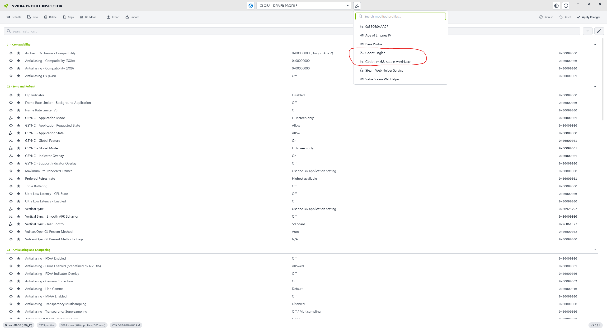
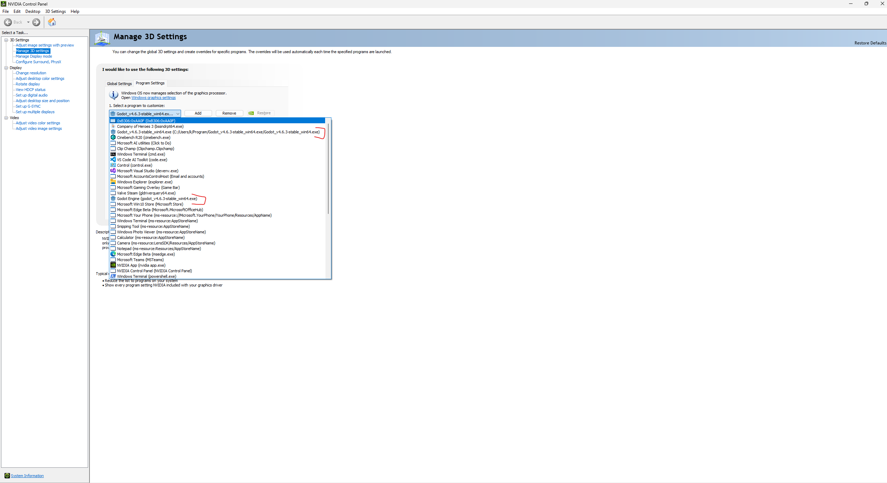
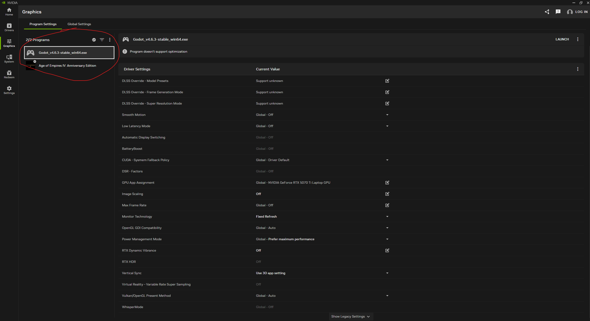

# Why NVIDIA App shows only one of the two Godot profiles

Captured on 2026-08-28 after both Godot profiles had been created.

## Conclusion

NVIDIA Profile Inspector and NVIDIA Control Panel are displaying the underlying Driver Settings (DRS) objects. NVIDIA App is displaying a different abstraction: its own application catalog, with one selected driver-profile name attached to each catalog entry.

The driver database still contains two distinct Godot profiles. NVIDIA App shows only the exact-path profile it created because it has one manual Godot application-catalog entry and that entry resolves to `Godot_v4.6.3-stable_win64.exe`. It does not enumerate the separately created `Godot Engine` DRS profile into its Program Settings list.

This is a NVIDIA App visibility and management limitation, not loss or merging of driver state.

## The two driver profiles

| Profile | Creator | Application association | Important settings |
|---|---|---|---|
| `Godot_v4.6.3-stable_win64.exe` | NVIDIA App | Exact full path: `c:/users/k/program/godot_v4.6.3-stable_win64.exe/godot_v4.6.3-stable_win64.exe` | Fixed Refresh, VRR disabled, G-SYNC mode disabled, plus four related defaults |
| `Godot Engine` | Godot | Basename only: `godot_v4.6.3-stable_win64.exe` | Fullscreen-only G-SYNC mode and disabled OpenGL threaded optimization |

The current read-only NVAPI query returns both, with 7,959 total DRS profiles. A full-path application lookup selects the NVIDIA App profile; a basename lookup selects `Godot Engine`.

## What each screenshot is showing

### NVIDIA Profile Inspector



NVIDIA Profile Inspector enumerates DRS profiles directly. Its modified-profile menu therefore contains both profile names as separate objects:

- `Godot Engine`
- `Godot_v4.6.3-stable_win64.exe`

This is the most literal profile-level view of the three interfaces.

### NVIDIA Control Panel



NVIDIA Control Panel also reads DRS directly, but its Program Settings dropdown presents application associations and combines the profile and application descriptions. It shows:

- the exact-path application under the `Godot_v4.6.3-stable_win64.exe` profile; and
- the basename application under the `Godot Engine` profile.

They can coexist because their stored application keys are different strings: one is a full path and the other is only a filename.

### NVIDIA App



NVIDIA App's `2/2 Programs` count refers to two entries in NVIDIA App's application list, not two Godot DRS profiles. Those entries are the manually added Godot executable and Age of Empires IV.

The Godot application record has local ID `963528738` and identifies the exact executable path. When that row is selected, NVIDIA App loads the single profile name associated with the row. Its current log shows:

```text
calling GetProfileInfo API with params : {"ProfileName":"Godot_v4.6.3-stable_win64.exe","ApplicationId":963528738,"CmsId":0,...}
```

The log records this at 13:42:18 and again while loading the selected program at 13:42:25. NVIDIA App does not request `Godot Engine`, and there is no second NVIDIA App catalog record representing that profile.

The visible **Monitor Technology: Fixed Refresh** value confirms which of the two profiles NVIDIA App is editing: only the exact-path NVIDIA App profile contains that setting.

## Why this happens

NVIDIA App's Program Settings page does not populate its sidebar by enumerating every DRS profile and application association. It starts from NVIDIA App's scanned/manual application catalog and then resolves one profile for each accepted application entry.

That architecture loses the one-to-many relationship present here:

```text
one executable image
├── exact-path association -> Godot_v4.6.3-stable_win64.exe
└── basename association   -> Godot Engine
```

NPI and NVCP preserve and display that relationship because they start from DRS. NVIDIA App starts from one application-catalog row, so only the profile chosen for that row is reachable.

## Practical consequences

- NVIDIA App is currently editing the correct, working Fixed Refresh profile.
- `Godot Engine` still exists and can be inspected in NPI/NVCP, but it cannot be selected, edited, or removed through NVIDIA App's current UI.
- The two profiles are not merged. Settings displayed by NVIDIA App are not a combined view.
- The basename-wide `Godot Engine` association can potentially match another copy of the same-named executable when the exact-path rule does not apply.
- If the NVIDIA App-created profile is removed while `Godot Engine` remains, NVIDIA App can return to the earlier create/adopt collision because it does not first expose and adopt the differently named existing profile.

The current successful runtime behavior is not contradicted by the missing row: NVIDIA's backend resolved the tested full executable path to the exact-path Fixed Refresh profile, which is why G-SYNC stayed inactive.
