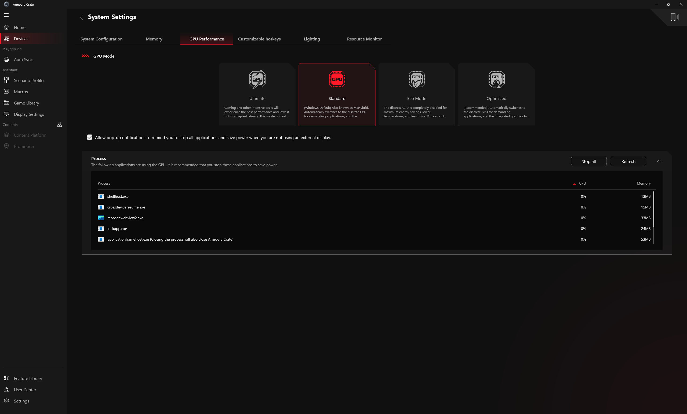
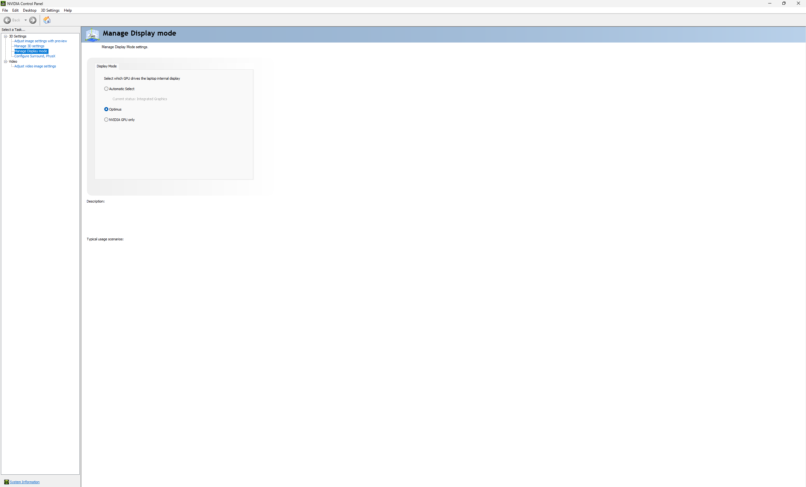

# Armoury Crate and NVIDIA display-mode relationship

Date: 2026-08-28

## User

explain the difference between these sets of settings. are the armoury crate modes supposed to be linked to the nvcp modes? or they supposed to be totally separate and independent? why don't i see an option for g-sync?

Attached screenshots:

## Assistant

They are linked and overlapping, but they are not a one-to-one set of duplicate controls.

Armoury Crate is the higher-level ASUS platform policy. It decides which GPUs are available and whether the laptop is in a hybrid or forced-dGPU topology:

| Armoury Crate GPU mode | Result |
|---|---|
| Ultimate | Forces the discrete NVIDIA GPU to drive the display through the hardware MUX. Best latency/performance, highest power use, and normally requires a reboot. |
| Standard | Enables MSHybrid: both GPUs are available. This is the prerequisite state in which NVIDIA Advanced Optimus can manage the internal-panel MUX. |
| Eco | Disables the NVIDIA GPU completely. NVIDIA Control Panel may disappear or become unavailable. |
| Optimized | Behaves like Standard on AC power and automatically disables the NVIDIA GPU like Eco on battery. |

NVIDIA Control Panel's Manage Display mode is the lower-level Advanced Optimus policy for who currently drives the internal panel while Armoury Crate permits hybrid operation:

| NVCP display mode | Result |
|---|---|
| Automatic Select | Enables Advanced Optimus Dynamic Display Switching. The driver changes the internal panel between the iGPU and NVIDIA GPU according to the running application. |
| Optimus | Disables the dynamic display switch. The iGPU always drives the internal panel; the NVIDIA GPU can still render a game, but its completed frames pass through the iGPU for display. |
| NVIDIA GPU only | Makes the NVIDIA GPU directly drive the internal panel, exposing dGPU display features such as G-SYNC when the panel supports them. |

The important combinations are therefore:

- Standard + Automatic Select: ASUS's documented Advanced Optimus/DDS configuration.
- Standard + Optimus: the configuration in the screenshots. It is valid, but the internal panel stays on the iGPU.
- Standard + NVIDIA GPU only: Advanced Optimus temporarily fixes the internal panel to the dGPU.
- Ultimate: reaches a similar dGPU-direct result at the ASUS platform/MUX layer, but it is not the same control and normally persists across a restart.
- Eco: makes the NVCP choice moot because the NVIDIA GPU is disabled.
- Optimized: the NVCP choice can be usable on AC but becomes moot when battery policy disables the NVIDIA GPU.

The missing G-SYNC page is expected in the shown state. NVCP says `Current status: Integrated Graphics`, and its navigation tree contains no `Display` category. Because Optimus is selected, the NVIDIA GPU does not own the internal panel's scanout. NVIDIA only exposes `Display > Set up G-SYNC` when it directly controls an active compatible display. Rendering a game on the NVIDIA GPU is not sufficient if the iGPU remains the display owner.

To make the page appear reliably:

1. Leave Armoury Crate on Standard.
2. In NVCP, select NVIDIA GPU only and apply. A short black-screen transition is normal.
3. Close and reopen NVCP. If the internal panel supports VRR/G-SYNC, `Display > Set up G-SYNC` should now appear.
4. After configuration, Automatic Select is the documented ASUS setting if dynamic switching is desired. While its current status is Integrated Graphics, the Display pages may disappear again; they return when the dGPU owns the panel.

Alternatively, Armoury Crate Ultimate plus its required restart guarantees the dGPU-direct topology. If the G-SYNC page remains absent in NVIDIA GPU only or Ultimate, the likely reasons are that the internal panel itself is not VRR/G-SYNC capable, or that the active external display is connected through an iGPU-wired port/dock. A compatible external monitor must be connected to a port routed to the NVIDIA GPU, have Adaptive-Sync enabled in its OSD, and normally be the primary display.

This machine's earlier recorded NVIDIA API state already proves that its RTX 5070 Ti Laptop GPU and driver can use G-SYNC: both connected ASUS PA278QGV external displays previously reported `gsyncType: 3` and `enabled: true`. Thus the page's current absence is a display-routing/topology issue, not evidence that G-SYNC support disappeared from the GPU or driver. If those monitors were disconnected for the screenshots, reconnecting one through the same dGPU-routed connection should restore the page.

Sources:

- [ASUS Armoury Crate GPU-mode definitions](https://www.asus.com/support/faq/1047107/)
- [ASUS Advanced Optimus instructions](https://www.asus.com/us/support/faq/1049565/)
- [NVIDIA display multiplexer reference](https://www.nvidia.com/content/Control-Panel-Help/vLatest/en-us/mergedProjects/3D%20Settings/Display_Multiplexer.htm)
- [NVIDIA G-SYNC setup requirements](https://www.nvidia.com/content/Control-Panel-Help/vLatest/en-us/mergedProjects/Display/To_use_variable_refresh_rates.htm)
