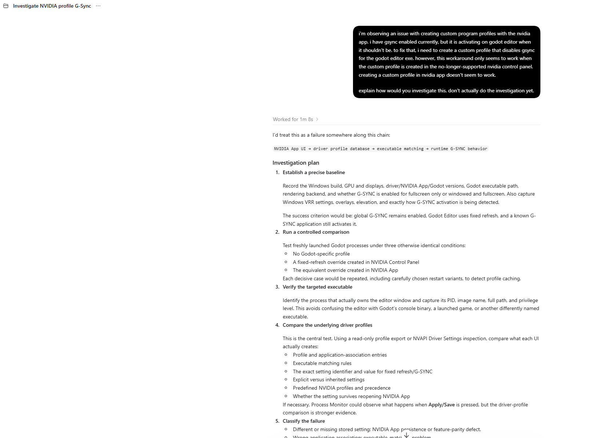

# NVIDIA App custom-profile and G-SYNC investigation

Date: 2026-08-28

## User

I'm observing an issue with creating custom program profiles with the NVIDIA App. I have G-SYNC enabled currently, but it is activating on the Godot editor when it shouldn't be. To fix that, I need to create a custom profile that disables G-SYNC for the Godot editor executable. However, this workaround only seems to work when the custom profile is created in the no-longer-supported NVIDIA Control Panel. Creating a custom profile in NVIDIA App doesn't seem to work.

We're going to investigate this. Do all of your work in the `2026-08-28 gsync investigation` subfolder.

First, tell me what kind of NVIDIA custom profile stuff is currently configured for `C:\Users\k\Program\Godot_v4.6.3-stable_win64.exe\Godot_v4.6.3-stable_win64.exe` (if any) and tell me how you determined that info.

## Assistant

Currently, none. At the approximately 12:31 PDT snapshot, the target executable has no NVIDIA DRS application association and no active custom program profile. Therefore it inherits the global NVIDIA settings; there is no per-program Fixed Refresh/G-SYNC override stored for it.

The direct checks were:

- `NvAPI_DRS_FindApplicationByName` returned `-166` (`NVAPI_EXECUTABLE_NOT_FOUND`) for both the full path and the normal DRS basename, `Godot_v4.6.3-stable_win64.exe`.
- `NvAPI_DRS_FindProfileByName` returned `-163` (`NVAPI_PROFILE_NOT_FOUND`) for both historically relevant names: `Godot_v4.6.3-stable_win64.exe` and `Godot Engine`.
- Enumerating all 7,957 DRS profiles found no profile name containing `Godot`.
- NVIDIA App's current `NvBackend\ApplicationStorage.json` contains no manual Godot entry.
- NVIDIA-related registry searches found no Godot entry.

I determined this with a small read-only utility that loads `nvapi64.dll` and uses NVIDIA's DRS query functions. It does not load any create, set, save, or delete entry points. I cross-checked the result against NVIDIA App's current application storage, its logs, and NVIDIA registry keys. No NVIDIA setting was changed.

The logs do preserve useful earlier history: NVIDIA App's attempt to create this association failed with `-167` (`NVAPI_EXECUTABLE_ALREADY_IN_USE`), its backend mapped the executable to `Godot Engine`, a later profile-creation attempt failed with `-164` (`NVAPI_PROFILE_NAME_IN_USE`), and the manual Godot entry was deleted successfully at 12:09:47. Those are earlier failed/removed records, not current active configuration.

Godot 4.6.3's own OpenGL initialization code can create a `Godot Engine` DRS profile, associate the executable basename, disable OpenGL threaded optimization, and set G-SYNC mode to fullscreen-only. That is the leading explanation for the earlier NVIDIA App collision, but the profile is absent now.

The evidence and reproducible query are stored in `findings.md`, `query-output.txt`, and `drs-query.cpp` in the investigation folder.

---

## User

Unity engine also has the same issue as Godot engine. Check if there's any custom profile stuff for `C:\Program Files\Unity\Hub\Editor\6000.3.22f1\Editor\Unity.exe` currently.

## Assistant

There is an active NVIDIA profile for `Unity.exe`, but it is not custom: the executable is associated with NVIDIA's predefined `Unity 3D` profile.

The important details are:

- The application match is `unity.exe` with no folder, launcher, or command-line qualifier. It is basename-wide rather than specific to Unity 6000.3.22f1, so it can match any executable named `unity.exe`.
- The profile contains eight settings. Every setting has `current_predefined=1`, so all eight are NVIDIA-supplied predefined values; there are no user-modified Unity-profile settings.
- None of the eight profile settings is a G-SYNC override.
- The effective G-SYNC application override is inherited from the global profile and is `0` (`allow`). The global VRR requested state and G-SYNC mode both currently report `1` (`fullscreen only`).
- Therefore, there is no Unity-specific Fixed Refresh, force-off, or other G-SYNC override stored right now.

NVIDIA App's own current application storage has no Unity entry, manual or detected. Its backend log shows that the scanner sees this exact Unity path but rejects it because its file version does not match the scanner's older `fv-2019` or `fv-2018` metadata. I found no NVIDIA App profile-creation or setting-write event for this editor path, and NVIDIA-related registry searches found no Unity entry.

I determined this by querying the live DRS database with the same read-only NVAPI utility, then cross-checking NVIDIA App's storage, logs, and registry keys. No NVIDIA setting was changed.

The full decoded snapshot is in `unity-findings.md`, with raw output in `unity-query-output.txt`.

---

## User

Let's ignore Unity and just focus on Godot for now.

I've done the following:

- Open a project in Godot 4.6.3 editor.
- Observed that the G-SYNC indicator in the top right was active.
- Observed that mouse movement was choppy while moving in the Godot editor, but when I pressed the Windows key and moved the mouse around in the Start menu, the mouse movement was smooth.

What is the current state of the custom profile for Godot, if any?

## Assistant

A custom profile now exists. Opening the project changed the live DRS state from the earlier no-profile baseline.

Current profile:

- Name: `Godot Engine`
- User-defined: yes (`predefined=0`)
- Application: `godot_v4.6.3-stable_win64.exe`
- Match scope: executable basename only; no folder, launcher, or command-line qualifier
- Explicit settings: two

The settings are:

- `0x1194F158 = 1`: G-SYNC mode - fullscreen only
- `0x20C1221E = 2`: OpenGL threaded optimization - disabled

The critical detail is what is missing: the profile has no per-application G-SYNC override (`0x10A879CF`). That value is inherited from the global profile as `0` (`allow`). Therefore the current Godot-created profile is not equivalent to a Control Panel **Fixed Refresh** override. Your active G-SYNC indicator shows that its two settings are not preventing G-SYNC in this windowed editor session.

This profile was created by Godot during the recent launch, not by NVIDIA App:

- The total DRS profile count increased from 7,957 to 7,958.
- The DRS database changed at 12:49:02.
- NVIDIA App's application storage is unchanged since 12:09:47 and still has no Godot entry.
- NVIDIA App began classifying the executable through the new `Godot Engine` DRS profile at 12:49:23.
- Godot 4.6.3's OpenGL code writes exactly this profile name, application association, and these two settings.

The full snapshot is in `godot-after-project-launch-findings.md`; the raw DRS output is in `godot-after-project-launch-query-output.txt`. No NVIDIA setting was changed.

---

## User

With the supplied screenshots, we have our first major issue: the custom Godot profile is visible in NVIDIA Control Panel and NVIDIA Profile Inspector, but not in NVIDIA App. NVIDIA has officially retired NVIDIA Control Panel for GeForce Game Ready and Studio drivers, while NVIDIA Profile Inspector is a third-party tool. Investigate why the official replacement does not show the profile.

Attached images:

## Assistant

Confirmed: this is an NVIDIA App profile-discovery/adoption defect, not a missing DRS profile or an NVIDIA Profile Inspector artifact.

The live NVIDIA driver database contains the user-defined `Godot Engine` profile and associates it with `godot_v4.6.3-stable_win64.exe`. NVIDIA Control Panel and NVIDIA Profile Inspector enumerate that database, so both show it. NVIDIA App does not build Program Settings by enumerating driver profiles. Its installed code starts from a separate scanned/manual application catalog and only resolves DRS profiles for entries that pass that catalog's filter.

The current NVIDIA App catalog contains Age of Empires IV and Steam, but no Godot. Age of Empires passes the UI filter and Steam does not, exactly explaining the screenshot's `1/1 Programs` display.

NVIDIA App's backend still recognizes the running executable through DRS and explicitly logs that its application-catalog record is null while the DRS profile name is `Godot Engine`. This proves the app has enough information to find the profile but does not use that information to populate Program Settings.

The manual-add path has a second defect. For a manual executable with no cached profile name, NVIDIA App first attempts to create a profile named after the executable, then resolves the executable's profile only if creation succeeds. Because Godot is already associated with the differently named `Godot Engine` profile, the create-first path collides instead of adopting it. The earlier log captured `NVAPI_EXECUTABLE_ALREADY_IN_USE` (`-167`) and `NVAPI_PROFILE_NAME_IN_USE` (`-164`), matching the installed code and NVIDIA's NVAPI definitions.

NVIDIA's current official statement confirms the impact: classic NVIDIA Control Panel is retiring for Game Ready and Studio drivers, receives no further features or fixes, and NVIDIA App's Graphics > Program Settings is its stated replacement. The replacement currently cannot expose this legitimate custom driver profile.

This is separate from the remaining G-SYNC problem. The current Godot profile contains `fullscreen only` mode and disabled threaded optimization, but no Fixed Refresh/application-level G-SYNC override. It therefore does not yet disable G-SYNC.

The full evidence, implementation trace, official sources, and a minimal NVIDIA bug report are recorded in `nvidia-app-profile-visibility-findings.md`. No NVIDIA settings were changed.

---

## User

I updated `AGENTS.md`. Fix the conversations organization accordingly.

## Assistant

Reorganized the records to follow the updated instructions:

- Consolidated this entire thread into this one conversation file.
- Located the file in the repository-root `Conversations` folder.
- Removed the four per-turn files from the investigation subfolder.
- Embedded links to the three attached screenshots in the applicable user turn; the image files remain preserved in the repository.
- Kept the reorganization in its own `[record]` commit.

---

## User

The conversations are incorrectly recorded. The screenshotted one-prompt conversation is separate from the current conversation. Fix this in the record.

Attached image:

## Assistant

Corrected the conversation boundary:

- Restored the screenshotted planning exchange as its own one-prompt conversation record.
- Kept the live profile investigation and all of its follow-up turns in this separate current-conversation record.
- Preserved and linked this corrective screenshot in the current record.
- Kept both records in the repository-root `Conversations` folder.

---

## User

Okay, let's get back to the investigation.

I'm going to do this:

1. Use NPI to delete the profile for Godot editor.
2. Use NVIDIA App to create a profile for Godot editor that explicitly disables G-SYNC.
3. Open Godot editor.
4. Observe what happens.

## Assistant

That is the right decisive test, with one important evidence checkpoint: pause after NVIDIA App creates and saves the profile, before opening Godot.

The controlled sequence should be:

1. In NVIDIA Profile Inspector, delete `Godot Engine`, apply the change, and close NPI.
2. Do not open Godot yet.
3. In NVIDIA App, manually add the exact editor executable and set **Monitor Technology** to **Fixed Refresh**, then apply/save it.
4. Pause and report that step 3 is complete. A read-only DRS snapshot and NVIDIA App storage/log snapshot can then establish exactly what NVIDIA App created.
5. Open the same Godot project using the same rendering backend as before.
6. Record whether the G-SYNC indicator appears and whether mouse movement is choppy.
7. Take another read-only profile snapshot to determine whether Godot retained, replaced, or failed to modify the NVIDIA App-created profile.

The pause is important because Godot's OpenGL startup code can create its own `Godot Engine` profile. Capturing the NVIDIA App state first separates NVIDIA App behavior from Godot's subsequent behavior.

---

## User

I'm going to do this:

1. Use NPI to delete the profile for Godot editor.
2. Use NVIDIA App to create a profile for Godot editor that explicitly disables G-SYNC.
3. Pause here and let you record state.
4. Open Godot editor.
5. Observe what happens.
6. Close Godot editor.
7. Report observations to you.

## Assistant

Yes. That sequence cleanly separates NVIDIA App's write from anything Godot does at startup.

At step 3, take a pre-launch read-only snapshot of the DRS profile, NVIDIA App application storage, and relevant logs. After step 7, take the same post-launch snapshot and compare the two states. The comparison will show whether Godot retained, replaced, augmented, or failed to modify the NVIDIA App-created profile.

---

## User

I deleted the Godot profile in NPI. Verify that there is no more custom profile stuff for Godot.

## Assistant

Confirmed. There is no remaining custom NVIDIA profile or application association for the Godot editor.

- Full-path and basename application lookups both return `-166` (`NVAPI_EXECUTABLE_NOT_FOUND`).
- Both relevant profile-name lookups return `-163` (`NVAPI_PROFILE_NOT_FOUND`).
- A profile scan finds no target-related profile.
- The total DRS profile count dropped from 7,958 to 7,957.
- NVIDIA App's separate application catalog still contains no Godot entry.

The live DRS database changed at 13:24:27 PDT, consistent with the NPI deletion. This is now a clean baseline for the next step. Verification was read-only.

---

## User

I created the Godot profile in NVIDIA App as shown in the screenshot, and then closed NVIDIA App. Record whatever state you need.

Attached image:

## Assistant

The pre-launch checkpoint is captured. NVIDIA App successfully created and persisted a user-defined DRS profile for the exact Godot executable, and the intended Fixed Refresh override is present in the live driver database.

- Profile: `Godot_v4.6.3-stable_win64.exe`
- Association: the exact full executable path, not a basename-wide match
- `0x10A879CF = 4`: G-SYNC application override = Fixed Refresh
- `0x1094F1F7 = 0`: VRR requested state = disabled
- `0x1194F158 = 0`: G-SYNC mode setting = disabled
- Total profiles: 7,958, up from the clean baseline of 7,957

NVIDIA App's logs independently show that the manual application add succeeded at 13:28:36, creation of the new DRS profile succeeded at 13:28:39, and the Monitor Technology write of value `4` succeeded at 13:28:50. Its application catalog now contains the manually added Godot entry. Both NVIDIA App and Godot were stopped when the final state was queried.

The screenshot, exact application catalog, decoded DRS query, selected NVIDIA App log evidence, and file timestamps and hashes are preserved in the investigation folder. No setting was changed during capture. This is the comparison point to use after Godot has been opened, observed, and closed.

---

## User

I opened a Godot 4.6.3 project, used the Godot editor interface for a bit, and then closed Godot.

I observed:

- a 2 or 3 second "blink" on both of my monitors as the Godot project was opened;
- no G-SYNC indicator at the top right corner;
- no choppy mouse movement; and
- no issues in general.

Investigate.

## Assistant

The NVIDIA App workaround succeeded. The post-launch driver state and NVIDIA logs agree with the observations: the exact-path NVIDIA App profile remained intact and was the profile NVIDIA's backend resolved for the running Godot executable.

Godot also created its usual separate `Godot Engine` profile during startup. The two now coexist:

- `Godot_v4.6.3-stable_win64.exe`, created by NVIDIA App, matches the exact full path and still has `0x10A879CF = 4` (Fixed Refresh), disabled VRR requested state, and disabled G-SYNC mode.
- `Godot Engine`, created by Godot, matches only the basename and has fullscreen-only G-SYNC mode plus disabled OpenGL threaded optimization.

The profile count increased from 7,958 to 7,959, but every decoded setting in NVIDIA App's profile is unchanged. At 13:34:27 and 13:35:27, NVIDIA's backend explicitly resolved the running full path to `Godot_v4.6.3-stable_win64.exe`, not `Godot Engine`. This, the absent indicator, and smooth pointer motion establish that Fixed Refresh won for this launch.

The monitor blink is consistent with the display pipeline switching from the global G-SYNC state to this application's Fixed Refresh state. Godot also saved the new `Godot Engine` DRS profile at 13:34:09, so one launch cannot distinguish profile activation from first-run profile creation as the immediate trigger. There was no matching Windows System event for a display-driver crash, timeout, or hardware transition.

The original defect is therefore narrower: NVIDIA App can create a working custom profile from a clean baseline, but it cannot reliably discover or adopt the differently named profile after Godot has created `Godot Engine` first. Once NVIDIA App's exact-path profile exists, Godot's later basename profile does not defeat it.

All post-launch evidence and the detailed comparison are preserved in `godot-nvapp-postlaunch-findings.md` and its companion snapshot files. No NVIDIA setting was changed during investigation.

---

## User

Based on my screenshots, it seems like NPI and NVCP are properly displaying these two different profiles, but NVIDIA App is not. Explain what's going on.

Attached images:

## Assistant

Yes. NPI and NVCP are showing the underlying driver-profile model correctly, while NVIDIA App is showing its separate application-catalog model.

The driver database contains two distinct profiles:

- `Godot_v4.6.3-stable_win64.exe`, created by NVIDIA App, associates the exact executable path and contains Fixed Refresh.
- `Godot Engine`, created by Godot, associates only the executable basename and contains fullscreen-only G-SYNC mode plus disabled threaded optimization.

NPI directly enumerates DRS profiles, so both profile names appear. NVCP also reads DRS directly, but presents their application associations; its dropdown shows the exact-path entry and the basename entry separately.

NVIDIA App's `2/2 Programs` does not mean two driver profiles. It means two entries in NVIDIA App's own application list: the manually added Godot executable and Age of Empires IV. NVIDIA App has only one Godot catalog row. When selected, current logs show it calling `GetProfileInfo` specifically for `Godot_v4.6.3-stable_win64.exe` and local application ID `963528738`. It never requests `Godot Engine`.

NVIDIA App therefore is not merging the two profiles or showing an alias. It exposes only the exact-path profile attached to its one Godot application row. The `Godot Engine` profile remains in DRS but cannot be selected, edited, or removed through NVIDIA App.

This is the same architectural limitation behind the earlier defect: NVIDIA App starts from its scanned/manual application catalog and resolves one profile per entry instead of enumerating all DRS profiles and application associations. Its data model loses the one-to-many relationship represented by an exact-path profile and a basename profile for the same executable image.

The visible Fixed Refresh setting confirms NVIDIA App is editing the correct working profile. The missing `Godot Engine` row does not affect this test's runtime result, because NVIDIA resolved the full executable path to the exact-path profile. The full mapping and screenshots are preserved in `two-godot-profiles-ui-explanation.md`.

---

## User

Explain how these two different profiles for Godot are distinguished. What is the unique identifier or unique identifiers? Also, what are the human-readable identifiers for each, and are those used as unique identifiers in the architecture?

## Assistant

The profiles are distinguished at two levels: a unique DRS profile name and a separate application match record.

The NVIDIA App-created profile has:

- DRS `profileName`: `Godot_v4.6.3-stable_win64.exe`
- DRS `appName`: the normalized exact full executable path
- DRS `userFriendlyName`: the original Windows-style full path
- NVIDIA App catalog `LocalId`: `963528738`

The Godot-created profile has:

- DRS `profileName`: `Godot Engine`
- DRS `appName`: only `godot_v4.6.3-stable_win64.exe`
- empty `userFriendlyName`
- no NVIDIA App catalog entry or `LocalId`

In public NVAPI DRS, `profileName` is both human-readable and the persistent unique profile key. `NVDRS_PROFILE` exposes no stable numeric ID or GUID. Creating a duplicate name returns `NVAPI_PROFILE_NAME_IN_USE`, and lookup is performed with `NvAPI_DRS_FindProfileByName`. NVAPI returns an opaque `NvDRSProfileHandle`, but that is a transient handle for the current session rather than a persistent identity.

The profile name does not match the process. Runtime matching uses the profile's `NVDRS_APPLICATION` record. In this case `appName` distinguishes the rules: one is a full path and the other is a basename. Optional launcher, folder, and command-line fields can qualify other records, but all are empty here. A fully qualified lookup returns the exact-path NVIDIA App profile; a basename lookup returns `Godot Engine`.

`userFriendlyName` is display metadata, not unique. NVIDIA App's `LocalId` uniquely identifies its application-catalog row, not the DRS profile. NVIDIA App's display/short name is also not a DRS identifier. Setting IDs such as `0x10A879CF` identify setting types and are reused across profiles.

The confusing part is that `Godot_v4.6.3-stable_win64.exe` appears in several namespaces: as one profile's unique `profileName`, as part of its full-path `appName`, as the other profile's basename `appName`, and as NVIDIA App's display name. Identical text across different fields does not mean identical identity. The detailed field mapping and NVAPI references are preserved in `godot-profile-identifiers.md`.
